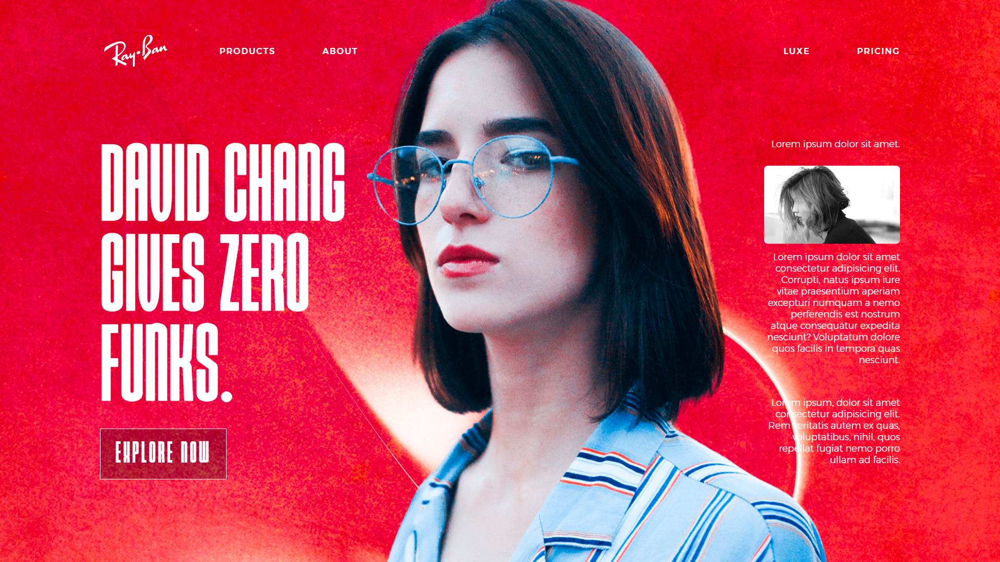

# Rayban Reimagine
This is reimagined concept of Rayban. This project replicates the visual design and represent Rayban.

## Table of Contents
- [Overview](#overview)
- [Pictures](#pictures)
- [Technologies Used](#technologies-used)

## Overview
This project is about [Shey js](https://www.npmjs.com/~sheryians),  created for educational purposes to demonstrate web development and design skills. The clone aims to match the aesthetics and functionality of the original site as closely as possible.

## Pictures
Here are some pictures of pages:

### Page 1

### Page 2

## Technologies Used
This project utilizes a range of modern web development technologies:

- **HTML5**: For the structure of the web pages.
- **CSS3**: For styling and layout, including Flexbox and Grid.
- **JavaScript**: For interactive elements and dynamic content.
- **GSAP (GreenSock Animation Platform)**: For creating animations and transitions.
- **Three Js**: For 3d graphics.
- **Shey Js**: For styling components and 3d animations.

Note: Kindly use desktop and chrome browser for better performance & experience.